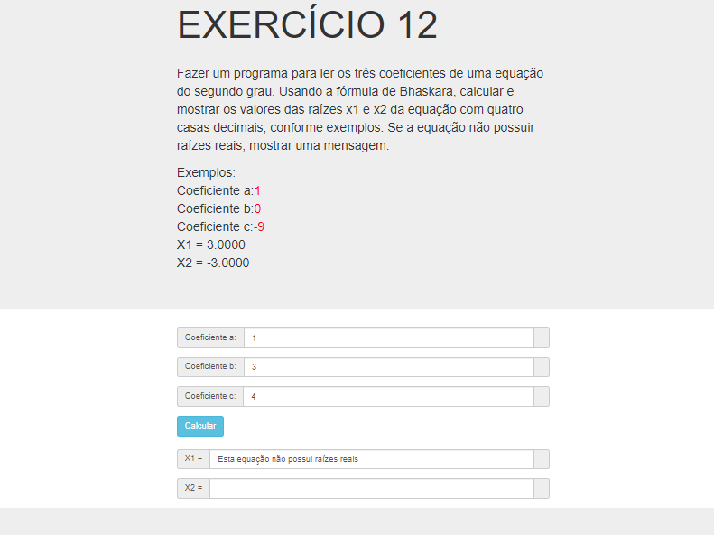

# Jovens Tegranos Exercicio 12

# 🏁 **Tópicos**

 * 👉 Banner
 * 👉 Título e Descrição
 * 👉 Status do Projeto
 * 👉 Funcionalidades
 * 👉 Demonstração da aplicação
 * 👉 Pré-requisitos
 * 👉 Tecnologias utilizadas
 * 👉 Autor
 * 👉 Licença
 
 ____________________________________________________________
# ✅ Banner 👌

<h1 align="center">
  
</h1>

# ✅ Título e Descrição 👌

### Exercicio 12

#### Fazer um programa para ler os três coeficientes de uma equação do segundo grau. Usando a fórmula de Bhaskara, calcular e mostrar os valores das raízes x1 e x2 da equação com quatro casas decimais, conforme exemplos. Se a equação não possuir raízes reais mostrar uma mensagem.
    Exemplos:
    Coeficiente a: 1
    Coeficiente b: 0
    Coeficiente c: -9
    X1 = 3.0000
    X2 = -3.0000

    Coeficiente a: 2
    Coeficiente b: -4.5
    Coeficiente c: 1.7
    X1 = 1.7697
    X2 = 0.4803

    Coeficiente a: 1
    Coeficiente b: 3
    Coeficiente c: 4
    Esta equação não possui raízes reais

# ✅ Status do Projeto 👌

### 🚧 Projeto 🚀 **Concluído com Sucesso!!!** 👌 🚧

# ✅ Funcionalidades 👌

### - [x] Ller os três coeficientes de uma equação do segundo grau.
### - [x] Usando a fórmula de Bhaskara, calcular e mostrar os valores das raízes x1 e x2 da equação com quatro casas decimais,
### - [x] Se a equação não possuir raízes reais, mostrar uma mensagem..

# ✅ Demonstração da aplicação 👌

<h1 align="center">
  
</h1>

### GitHub AlineAlmeida85

### Link: [Projeto]()

# ✅ Pré-requisitos 👌

### Nenhum, basta clicar no link acima

# ✅ Tecnologias utilizadas ⚒️ 👌

### As seguintes tecnologias foram usadas na construção do projeto:

- [HTML](https://pt.wikipedia.org/wiki/HTML)
- [CSS](https://pt.wikipedia.org/wiki/Cascading_Style_Sheets)
- [JavaScript](https://www.javascript.com/)

# ✅ Autor 👌

### Aline Almeida 💝

# ✅ Licença

### Não Possui

#### Espero que te agrade! ❤️